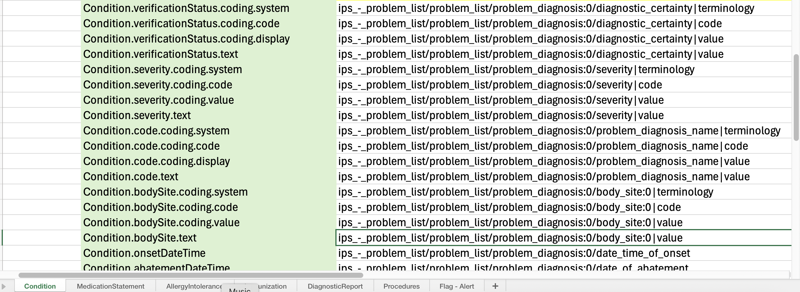

# Reflective Writing Entry 2
**Date of entry:** 3rd November 2025

The last few month's focus have been on establishing a working [International Patient Summary (IPS)](https://build.fhir.org/ig/HL7/fhir-ips/en/) extract from Better Platform's **openEHR** and **FHIR** data repositories.

The video below shows the flow demonstrated at **NHSE Shared Care Record Summit**:

  <iframe style="position: absolute; top: 0; left: 0; width: 100%; height: 100%;" 
  src="https://www.youtube.com/embed/XKxFOQnnHZs" 
  frameborder="0" allowfullscreen></iframe>

## My role within the demonstrator
1. Submitted the data based on IPS openEHR templates as saved compositions to **openEHR** Clinical Data Repository based on a cardiac clinical scenario
2. Created the **AQL** queries to extract the data from openEHR CDR - i.e. Problem List
3. Saved AQLs as **API views** to be queried with defined parameters - i.e. ehrId
4. Authored mapping tables between **FHIRPath** and **openEHR FLAT path** including valueSet mappings
5. Created the frontend data visualisations from the FHIR **$IPS operation call** - HTML, structured views and QR code displayed

*Figure 1: Example of IPS FHIRPath <---> openEHR FLAT path mapping between Condition and Problem/Diagnosis*

## Thanks and attributions
1. **Richard Kavanagh** developed the orchestration of API calls to openEHR CDR and FHIR ODR and implemented the mappings between openEHR FLAT path and FHIRpath to construct the valid FHIR IPS bundle response AND established **SMART Health Link QR code** to render IPS in external 3rd party system :clap: :tools:
2. The IPS templates were based on the data modelling by **Heather Leslie**, **Heidi Koikkalainen** and **Wouter Zanen** who have done brilliant work analysing current IPS specification and reflecting this in openEHR :raised_hands:
3. My fellowship supervisor **Rachel Dunscombe** has been a constant support throughout and has connected me with the wider openEHR community who are working on similar areas. Likewise, **Ian McNicoll** as my fellowship mentor is always available to discuss and make sense of complex clinical informatics areas :raised_hands:

## Updates on openEHR Implementation Guide using FHIR IG Publisher
At the brilliant **EHRCON25** event in Barcelona, it became apparent that there are lots of different people working on openEHR Implementation Guides (IG) utilising FHIR IG Publisher. The objectives and end goals for having the capability to produce an openEHR IG are varied. My own openEHR fellowship has a focus on openEHR IGs to lower the barrier for interacting with openEHR-based implementations through published examples of API calls, responses and supporting information.

- I have established an entry on [HL7 Confluence page](https://confluence.hl7.org/spaces/FHIRI/pages/391649620/openEHR+Implementation+Guide) for the community of interest to start defining a shared understanding of and objectives for openEHR IG.
- I have set up the first of (hopefully) a series of calls to bring community of interest together to discuss progressing openEHR IG

## Next steps
1. As part of **FHIR Connect** working group, I will be reviewing the mappings between openEHR and FHIR in order to publish reproducible IPS openEHR <---> FHIR mappings - special thanks to **Severin Kohler** for his work on FHIR Connect specification, [establishing a set of mappings](https://github.com/SevKohler/FHIRconnect-spec) and setting up the working group.
2. Update and document the agreed objectives of openEHR IG as part of bringing community of interest together
3. Publish openEHR artifacts utilising FHIR IG publisher.
4. Contribute to openEHR IPS clinical modelling group - thank you to **Heidi Koikkalainen** for organising these discussions and including me