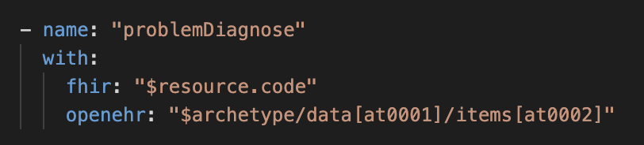
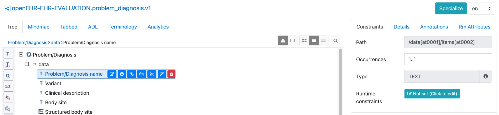

# Reflective Writing Entry 3
**Date of entry:** [15/02/2026]

In line with my Fellowship focussing on the bridge between **FHIR** and **openEHR**, I've been progressing my understanding of **FHIR Connect** through writing FHIR Connect mappings.

For the IPS demonstrator (see [Reflective Writing Entry 2](reflective-entry-2.md)), I created openEHR → FHIR mapping file definitions in Excel tables. These were subsequently bespokely coded for unidirectional data mapping (openEHR → FHIR). By comparison, FHIR Connect allows for **reusable**, **bidirectional**, **no-code** mappings to be written by clinical informaticians that are then run by standardised engines to produce the required FHIR or openEHR output.

## What is FHIR Connect

[FHIR Connect](https://sevkohler.github.io/FHIRconnect-spec/build/site/FHIRconnect/v1.0.0/index.html) is a specification for bidirectional mapping between openEHR and FHIR. The syntax to write FHIR Connect mapping files is based upon [FHIRPath](https://build.fhir.org/fhirpath.html) and [openEHR paths](https://specifications.openehr.org/releases/BASE/latest/architecture_overview.html#_paths).

## Example mapping

Figure 1 shows the FHIRpath for the [code](https://hl7.org/fhir/R4/condition-definitions.html#Condition.code) element within the **Condition** resource being mapped to the openEHR path for 'Problem/Diagnosis name' within the [Problem/Diagnosis archetype](https://ckm.openehr.org/ckm/archetypes/1013.1.169). 



*Figure 1: FHIR Condition.code <--> Problem/Diagnosis mapping*

The openEHR path can be obtained easily within within Archetype Designer. This is shown in Figure 2.



*Figure 2: Archetype Designer showing Problem/Diagnosis name openEHR path*

In Figure 3, you can see how Condition.code describing Chronic Kidney Disease within a FHIR Bundle maps bidirectionally to Problem/Diagnosis name within an openEHR composition displayed in FLAT format.

**FHIR (Condition.code):**

```json
"code": {
  "coding": [
    {
      "system": "http://snomed.info/sct",
      "code": "709044004",
      "display": "Chronic Kidney Disease"
    }
  ],
  "text": "Chronic Kidney Disease"
}
```

**openEHR FLAT:**

```
"problem_list_nl/problem_diagnosis/problem_diagnosis_name|code": "709044004",
"problem_list_nl/problem_diagnosis/problem_diagnosis_name|value": "Chronic Kidney Disease",
"problem_list_nl/problem_diagnosis/problem_diagnosis_name|terminology": "http://snomed.info/sct"
```

*Figure 3: Mapping of Chronic Kidney Disease between FHIR Condition and openEHR Problem/Diagnosis*

This mapping was run in [openFHIR](https://open-fhir.com/) which is an engine capable of running FHIR Connect mappings to convert between openEHR compositions and FHIR Bundles.

## Tackling edge cases

I have been working on some of the edge cases for mappings, including:

1. **Mapping FHIR IPS Bundle structure to top-level composition archetype** – As part of a FHIR Connect Working Group, we have been iterating on how to map the highly nested FHIR IPS Bundle structure to top-level openEHR composition archetypes. For example, mapping the **Problem List** archetype to the FHIR **Composition** resource.

```yaml
mappings:
  - name: "date"
    with:
      fhir: "$resource.date"
      openehr: "$composition/context/start_time"

  - name: "sectionActiveProblems"
    with:
      fhir: "$resource.section"
      openehr: "$archetype"
    followedBy:
      mappings:
        - name: "entry"
          with:
            fhir: "entry.as(Condition)"
            openehr: "$composition/content[openEHR-EHR-EVALUATION.problem_diagnosis.v1]"
            type: "NONE"
          slotArchetype: "EVALUATION.problem_diagnosis.v1"
        - name: "title"
          with:
            fhir: "$fhirRoot"
            openehr: "$archetype"
          manual:
            - name: "manualTitle"
              fhir:
                - path: "title"
                  value: "Active Problems"
```

*Figure 4: Snippet of FHIR Composition mapping to Problem List archetype*

<ol start="2">
<li><strong>Using ConceptMaps to map between valueSets</strong> – I have been testing out <strong>ConceptMaps</strong> to map between different valueSets. This includes mapping the <code>at000x</code> codes used in openEHR archetypes (e.g. <code>at0002</code>, <code>at0003</code>) to FHIR valueSets, enabling consistent terminology translation in both directions. For example, Condition.severity is a simple example where at000x codes used for high, medium and low in the Problem/Diagnosis archetype need to map to the SNOMED codes with a <a href="https://hl7.org/fhir/R4/valueset-condition-severity.html">preferred terminology binding</a> in FHIR.</li>

<li><strong>Creating FHIR reference resources</strong> – Within the mappings, there is often a need to create a FHIR resource that is referenced within the overall mapped resource – i.e. mapping Practitioner details held in the context part of openEHR composition to <a href="https://hl7.org/fhir/R4/condition-definitions.html#Condition.recorder_">Condition.recorder</a>. We have been working on this mapping topic in the FHIR Connect Working Group.</li>
</ol>

## What next

For the final months of the Fellowship, I will be focussing on producing and publishing:

- IPS FHIR Connect mappings to represent the clinical informatics work that is being completed to define the [clinical mappings](https://confluence.hl7.org/spaces/PC/pages/391645300/HL7+openEHR+Collaboration+-+International+Patient+Summary+Alignment+Workstream)
- Example openEHR FHIR IG – whilst all the technical details and pipelines may not be completed by the end of this Fellowship, I hope to produce a working prototype whereby an openEHR implementation leverages the structure of FHIR IG Publisher

## Thanks and attributions

- Many thanks to **Severin Kohler** and **Gasper Andrejc** for their work and support on FHIR Connect.
- Also, thank you to **Heather Leslie**, **Heidi Koikkalainen** and **Wouter Zanen** for their clinical informatics work to progress documenting the mappings between FHIR resources and openEHR archetypes within the context of IPS FHIR Profiles and IPS openEHR template (which they are also updating!).