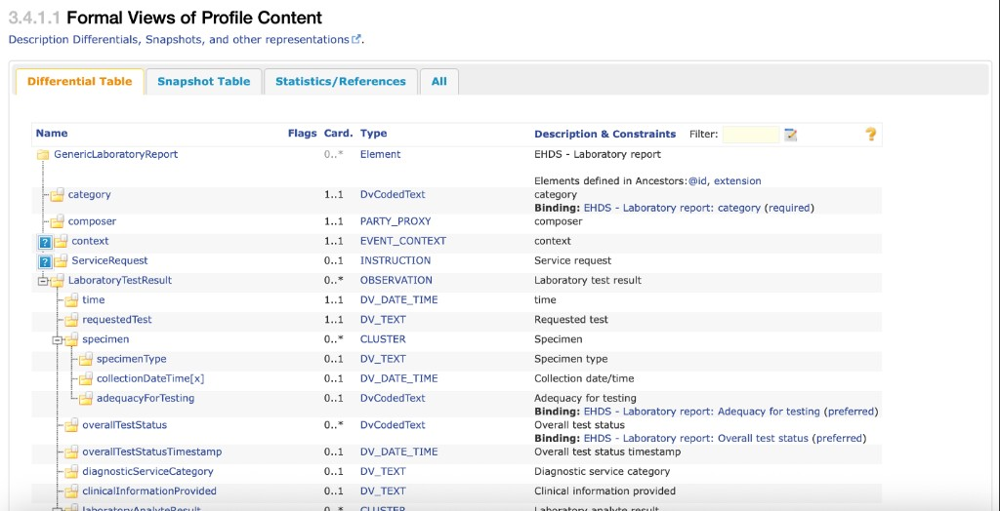
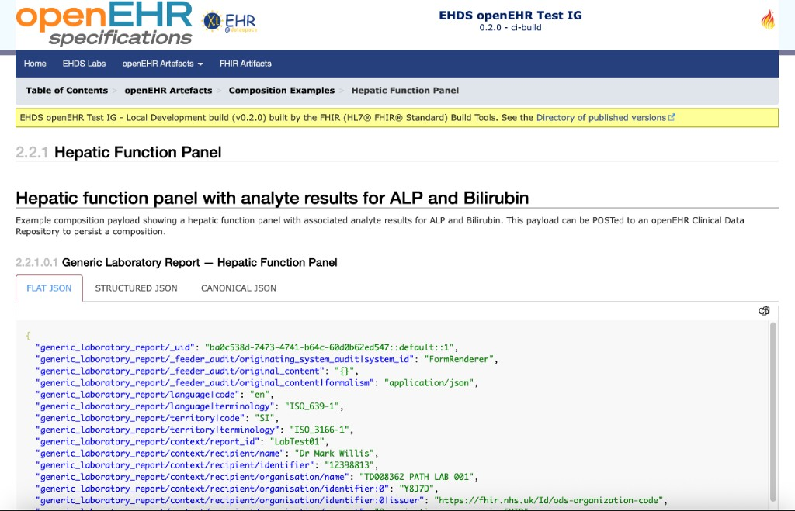
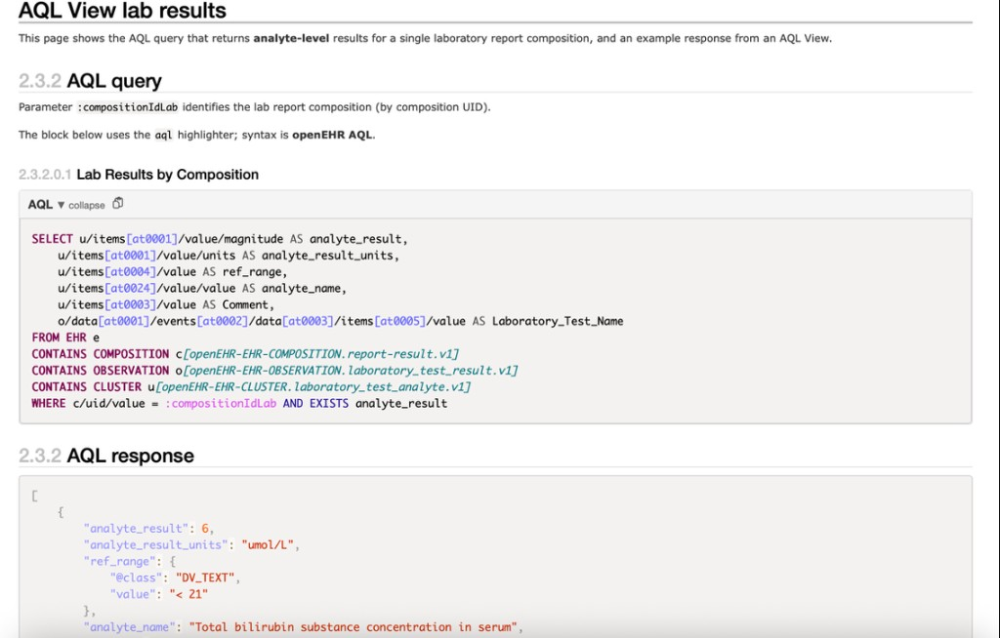

# Reflective Writing Entry 4
**Date of entry:** [11/05/2026]

Last week I presented a summary of my Fellowship - **How to publicly document an openEHR implementation**. I fed back my learnings on how openEHR artefacts could be provided in the same **discoverable, versioned, implementer-facing** packaging that the HL7 community uses through [FHIR Implementation Guides (IGs)](https://hl7.org/fhir/implementationguide.html).

## What are FHIR IGs and why should they be leveraged for openEHR artefacts

A FHIR Implementation Guide (IG) is a structured set of rules, profiles, examples, and other artefacts that define how FHIR should be implemented within a specific real-world interoperability scenario. It provides both human-readable guidance and machine-processable definitions that describe how data should be exchanged in accordance with the IG.

Key aspects of a FHIR IG typically include:

1. Practical guidance on **how to actually implement FHIR** in real-world workflows and integrations.

2. **FHIR Profiles** that define the structure, meaning, and rules governing API payloads, covering for example:

    - **Constraints**
    - **Extensions**
    - **Cardinality**
    - **Data types**
    - **Terminology bindings**

3. **Human-readable HTML views and examples** that make profiles easier to understand and implement by showing realistic payload structures and usage patterns.

4. A **machine-readable package of artefacts** that supports:

    - **Validation**
    - **Conformance checking**
    - **Deployment**
    - Loading curated profiles and terminology assets onto FHIR servers

## Fellowship deliverables

Given the benefits of FHIR Implementation Guides and the lack of equivalent implementation documentation for openEHR, I decided to focus on delivering an Implementation Guide containing openEHR artefacts using the HL7 IG Publisher for authoring and publication. To align with the themes of the openEHR–FHIR Converge or Collide conference, the example content was based on the International Patient Summary (IPS).

## Defining the content for an openEHR IG

Following the openEHR conference in late 2025, I convened a series of meetings with FHIR and openEHR representatives to deliberate the makeup of an openEHR IG [Meeting notes](https://confluence.hl7.org/spaces/FHIRI/pages/413041277/3rd+December+2025+follow+up+meeting)

Some of the key artifacts to provide into an IG for implementers include:
- **Logical models based on openEHR templates** - utilise logical models to describe the data requirements of an openEHR template from a functional and clinical perspective
- **Example payloads** — example compositions based on IPS templates
- **Example queries paired with example responses** — AQL snippets and results

## Generating the FHIR IG

For the **openEHR IHE Connectathon**, the following openEHR artifacts based on **EHDS Laboratory Results** were published in the **[EHDS openEHR Test IG](https://irbennett.github.io/EHDS-Labs-openEHR-FHIR-IG/en/index.html)** (hosted on GitHub Pages):

1. Logical model representation of **EHDS Laboratory Results** openEHR template

    

    *Figure 1: Formal view (differential table) of the **GenericLaboratoryReport** logical model in published IG HTML*

2. Markdown **example Composition** aligned with clinical laboratory test results flow

    

    *Figure 2: Published IG page documenting a **hepatic function panel** example composition (FLAT / structured / canonical views), illustrating how payloads can be shown in implementer-ready form.*

3. Markdown **AQL and response** excerpts to query key clinical data.

    

    *Figure 3: **AQL query** targeting laboratory analyte archetypes (`report-result`, `laboratory_test_result`, `laboratory_test_analyte`) with `:compositionIdLab`, paired with an **example JSON response** for querying key laboratory data.*

## Key learnings and next steps

- The Fellowship work showed it is feasible to **use the HL7 IG Publisher** to publish openEHR artefacts to support implementation and integration.
- **Markdown** works well as a lightweight way to prototype and gather feedback around areas such as:
  - **Automation pipelines to IG Publisher** (for example from Archetype Designer and CKM)
  - **Which artefacts ought to be machine-readable / computable**
  - **Where HL7 IG Publisher itself may need changes** to meet openEHR-oriented publishing goals
- The IG produced has helped steer the conversation about how this can be taken forward.

## Personal development

Beyond the artefacts themselves, the Fellowship involved sustained community participation which I've benefittd from immensely including:

- Continued involvement in **FHIR Connect** governance and editorial meetings (including Converge and Collaborate speaking slot).
- Direct contributions to **openFHIR** engine code for different openEHR <---> FHIR mapping use cases
- Running a GitHub repo that attracted **external debugging collaborations** 
- Shipping my first independently published sites: both the exploratory [**EHDS openEHR IG**](https://irbennett.github.io/EHDS-Labs-openEHR-FHIR-IG/en/index.html) and this **Fellowship** site

## Thanks and attributions

Special thanks to:

- **Rachel Dunscombe** (Fellowship supervisor) — for her invaluable direct support, and helping me reach the wider informatics community.
- **Ian McNicoll** (Fellowship mentor) — for his patient guidance throughout the project and generous hands-on contribution (including code).
- **Abi Bouvier** — for organising and running an excellent Fellowship programme.

Colleagues who contributed their time and expertise along the way:

- **Richard Kavanagh**
- **Gasper Andrejc**
- **Severin Kohler**
- **Heather Leslie**
- **Heidi Koikkalainen**
- **Wouter Zanen**
