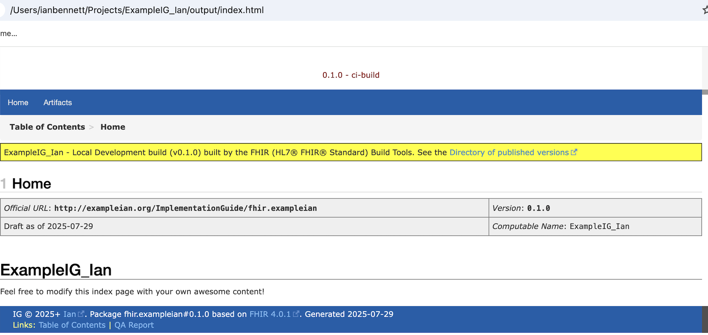

# Reflective Writing Entry 1
**Date of entry:** 30th July 2025

My first few months of the fellowship have flown by with fish puns reverberating round my brain … more on that later … hopefully that reels you in :fishing_pole_and_fish: 

My fellowship focuses on how to publish openEHR implementation guidance. A key objective is to publish openEHR artifacts using the FHIR Implementation Guide (IG) Publisher. The clinical content of these openEHR artifacts will be based on the International Patient Summary (IPS). In addition, I am collaborating with colleagues to expose data from an openEHR CDR through a FHIR API façade, delivering outputs conformant with the IPS FHIR specification. I intend to document any IPS openEHR <---> FHIR mappings within the FHIR IG referenced above. The full proforma can be accessed [here](https://irbennett.github.io/openEHR_Fellowship/intro/).

## Reflections on the overall Fellowship programme
The content of the Fellowship programme in terms of the presentations and recommended reading has been extremely thought provoking. The argument for adopting a longitudinal health record approach and how openEHR supports this was clearly articulated and expertly presented by **Heather Leslie**. Alongside clinical informatics leadership, **openEHR** adoption has also been driven by:

1. an explicit recommendation to adopt openEHR within digital healthcare policy. This was clearly demonstrated by **Jordi Piera's** excellent presentation of the openEHR driven transformation of the Catalan Health System at our second Fellowship monthly meeting. Having openEHR at the heart of the digital healthcare policy is enabling the delivery of an innovative application ecosystem at scale underpinned by a common semantic data model.

2. individual healthcare systems and regions that have demonstrated the benefits of a vendor-neutral, platform based approach. **Anze Droljc** outlined, also within our second monthly meeting, how the Slovenian National Shared Care Record has continually leveraged its openEHR platform to iteratively deliver additional use cases over time to improve patient outcomes.

My experience of openEHR based implementations across different healthcare systems of varying digital maturity is that the fundamentals and foundations of openEHR have accelerated application delivery, data integration and legacy system data migration.
Looking into the future, I expect more healthcare systems and regions will implement a strategy and digital policy that includes openEHR, leveraging the experience of those who have embedded openEHR into policy.

## Progress so far
During the first few months of the fellowship, my activities have included:

1. Gaining access to the latest openEHR Archetype Designer repository where IPS is being modelled in openEHR. This work is being undertaken by an established working group of clinicians commissioned by openEHR International.
    
    - POSTed compositions based on sections of the IPS template (Problem List) into the Better Platform openEHR CDR via openEHR API.

2. Reviewing and contributing to FHIR Connect specifications - see [GitHub Pull Request](https://github.com/SevKohler/FHIRconnect-mapping-lib/pull/8).

3. Working hands-on with openFHIR engine deployed within Better infrastructure to run and test mappings between the `Problem_diagnosis` openEHR archetype and the `Condition` FHIR Resource.

4. Downloading and running [GoFSH and SUSHI](https://fshschool.org/docs/) to generate and locally deploy my first FHIR Implementation Guide (IG).

*Figure 1: Locally deployed FHIR IG example*

  - Each time you deploy a FHIR IG, you receive a fishy pun 🐟.

*Figure 2: SUSHI: Compiling FHIR Shorthand (FSH) into FHIR JSON — with a fishy pun for good measure*

---

## FAQs
There are areas I've discovered during this first phase that have helped clarify aspects of the overall approach and define the project scope more clearly. This may form an ongoing set of project FAQs:

- **Q:** How will we map between FHIR Search Parameters and AQL when making FHIR API calls to the openEHR CDR?

- **A:**  The FHIR IPS Summary uses $operation so there will be no FHIR Search Parameters included in the API request. The business logic (i.e. applying a date range to retrieve data) will be within the AQL and this logic will be written up into the published FHIR IG.

---

- **Q:** How will we map the response from an AQL View?

- **A:** All API calls to Better Platform openEHR CDR will need to return a FLAT composition format to then be processed by FHIR Connect mappings.
 
---

- **Q:** Given problems, medications and other data may be captured in multiple different openEHR templates, how can we streamline the mapping to a single set of IPS FHIR profiles?

- **A:** Initial discussions have explored the FHIR Connect specification being updated to reflect a capability to pull archetype-based mappings via AQL. This would reduce the dependency on mapping against templates that were used to save the composition.
For the Fellowship, data will be stored in the openEHR CDR as compositions based on IPS template(s).

## Next steps
During the next phase of the fellowship, I plan to work on the following:

1. Publish FHIR Connect mappings based on IPS Required dataset (Problems, Allergies, Medications)

2. Publish a set of tool-agnostic mappings - i.e. mapping tables in Excel between openEHR templates and FHIR IPS profiles

3. Process FHIR Connect mappings end to end using openFHIR tooling - i.e. pull a FLAT composition from openEHR CDR and transform it into a FHIR bundle that meets IPS FHIR specified format

4. Publish logical models from openEHR templates into a FHIR IG - ongoing work with Fellowship mentor - **Ian McNicoll**